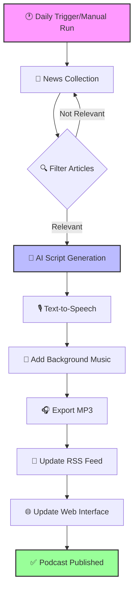

# 🛢️ Oil Field Insights Daily - AI Podcast Generator

An intelligent podcast generation system that creates daily, soothing conversations about the oil and gas industry using advanced AI and neural text-to-speech technology.

## 🎧 About

Experience AI-generated discussions between two hosts with natural conversation flow, industry insights, and market analysis. The podcast is distributed via RSS feed and can be hosted on any web server or podcast platform.

## 🔄 Process Flow



## ✨ Key Features

### 🤖 AI-Powered Intelligence
- **Google Gemini AI Integration**: Creates dynamic, NotebookLM-style dialogue scripts
- **Smart News Filtering**: Relevance scoring system prioritizes drilling, extraction, and production news
- **Market Data Integration**: Includes real-time WTI/Brent crude prices in discussions
- **Natural Conversation Flow**: Context-aware dialogue with emotional variations

### 🎙️ Advanced Audio Production
- **Microsoft Edge TTS Neural Voices**: High-quality, natural voices with emotion support
  - Male host: GuyNeural (warm, friendly tone)
  - Female host: AriaNeural (gentle, conversational style)
- **Ambient Background Music**: Subtle, auto-generated music with intelligent ducking
- **Smart URL Processing**: Converts URLs to speakable domain names
- **Industry Term Pronunciation**: Proper handling of oil & gas terminology (OPEC, WTI, LNG, etc.)
- **Optimized Pacing**: Natural speech flow with minimal gaps for fluent conversation

### 📰 Comprehensive News Coverage
- **20+ RSS Feed Sources**: Including Rigzone, OilPrice.com, Bloomberg Energy, EIA
- **Intelligent Article Ranking**: Weighted keyword system for relevance
- **Multi-Source Aggregation**: Government, industry, financial, and regional sources
- **Daily Updates**: Automated GitHub Actions workflow at 12:00 PM UTC

### 🚀 Production Pipeline
- **Fully Automated**: End-to-end generation from news collection to audio publishing
- **Robust Error Handling**: Retry logic with exponential backoff for network issues
- **Audio Optimization**: FFmpeg processing for streaming-ready MP3s
- **Episode Management**: Automatic cleanup keeps last 30 episodes

## 📦 Installation

### Prerequisites
- Python 3.8+
- FFmpeg (for audio processing)
- Google Gemini API key (optional, for AI script generation)

### Quick Setup

1. **Clone the repository**:
```bash
git clone https://github.com/shariqbaig/oil-podcast-generator.git
cd oil-podcast-generator
```

2. **Install dependencies**:
```bash
pip install -r requirements.txt
```

3. **Configure environment** (optional for AI features):
```bash
cp .env.example .env
# Edit .env and add your GEMINI_API_KEY
```

4. **Generate your first podcast**:
```bash
python main.py
```

## 🔧 Configuration

### Environment Variables
- `GEMINI_API_KEY`: Google AI API key for enhanced script generation (get one [here](https://makersuite.google.com/app/apikey))
- `PODCAST_BASE_URL`: (Optional) Base URL for RSS feed generation
  - For GitHub Pages: `https://[username].github.io/[repository-name]`
  - For custom hosting: `https://yourdomain.com/podcast`
  - If not set, uses relative paths

### Voice Customization
Edit `src/podcast_creator.py` to adjust:
- Voice selection (Edge TTS offers 100+ voices)
- Speaking rate and pitch
- Pause durations
- Emotional tone mappings

### News Sources
Modify `src/news_collector.py` to:
- Add/remove RSS feeds
- Adjust keyword weights
- Change relevance thresholds
- Focus on specific topics

### Script Style
Configure `src/script_generator.py` for:
- Host personalities
- Conversation length
- Topic emphasis
- Dialogue patterns

## 📁 Project Structure

```
oil-podcast-generator/
├── main.py                      # Main orchestration script
├── requirements.txt             # Python dependencies
├── .env.example                 # Environment variable template
├── src/
│   ├── __init__.py             # Package initialization
│   ├── news_collector.py       # RSS feed aggregation and filtering
│   ├── script_generator.py     # AI dialogue generation (Gemini)
│   ├── podcast_creator.py      # Edge TTS audio synthesis
│   ├── music_generator.py      # Background music generation
│   └── rss_generator.py        # Podcast RSS feed creation
├── docs/
│   ├── episodes/               # Generated MP3 files
│   ├── feed.xml               # Podcast RSS feed
│   ├── index.html             # Web player interface
│   └── README.md              # Documentation for web hosting
├── tests/
│   └── test_tts.py            # TTS testing utilities
└── .github/
    └── workflows/
        └── generate_podcast.yml # Daily automation (GitHub Actions)
```

## 🎛️ Technical Architecture

### Component Interaction

```
┌─────────────────────────────────────────────────────────────┐
│                         main.py                              │
│                    (Orchestration Layer)                     │
└──────────┬────────────────────────────────────┬─────────────┘
           │                                    │
           ▼                                    ▼
┌──────────────────────┐              ┌──────────────────────┐
│  news_collector.py   │              │  script_generator.py │
│  - Fetch RSS feeds   │              │  - Gemini AI prompts │
│  - Score relevance   │◄─────────────│  - Dialogue creation │
│  - Filter articles   │   Articles   │  - Emotion mapping   │
└──────────────────────┘              └──────────────────────┘
           │                                    │
           │                                    ▼
           │                          ┌──────────────────────┐
           │                          │ podcast_creator.py   │
           │                          │  - Edge TTS voices   │
           │                          │  - Audio processing  │
           │                          │  - Music mixing      │
           └──────────────────────────└──────────┬───────────┘
                                                │
                      ┌─────────────────────────┼───────────┐
                      ▼                         ▼           ▼
           ┌──────────────────┐     ┌──────────────┐  ┌────────────┐
           │music_generator.py│     │rss_generator │  │  Output    │
           │ - Ambient sound  │     │ - XML feed   │  │ - MP3 file │
           │ - Audio ducking  │     │ - Episodes   │  │ - RSS feed │
           └──────────────────┘     └──────────────┘  └────────────┘
```

## 🔄 Automated Daily Generation

The podcast generates automatically via GitHub Actions:
- **Schedule**: Daily at 12:00 PM UTC
- **Process**: News collection → AI script → Audio synthesis → Publishing
- **Requirements**: Add `GEMINI_API_KEY` to GitHub Secrets

### Manual Trigger
Run the workflow manually from GitHub Actions tab or via API:
```bash
gh workflow run generate_podcast.yml
```

## 🎯 Recent Improvements

### v2.3 (Latest)
- ✅ Removed all hardcoded URLs for portability
- ✅ Made RSS generator configurable via environment
- ✅ Added automatic URL detection in GitHub Actions
- ✅ Enhanced documentation with flow diagrams

### v2.2
- ✅ Added subtle ambient background music generation
- ✅ Improved speech fluency with reduced pauses
- ✅ Removed excessive laugh sounds for more natural conversation
- ✅ Optimized voice speeds for better flow
- ✅ Enhanced audio mixing with music ducking

### v2.1
- ✅ Extended episodes to 15 minutes with deeper discussions
- ✅ Added natural laughs, reactions, and conversational elements
- ✅ Implemented 8 new emotion states (amused, surprised, skeptical)
- ✅ Enhanced Gemini prompts for more engaging dialogue
- ✅ Fixed ffmpeg workflow issues

### v2.0
- ✅ Migrated from OpenAI to Google Gemini AI
- ✅ Switched to Edge TTS for superior voice quality
- ✅ Added soothing voice profiles for relaxed listening
- ✅ Implemented smart URL cleaning (no more "HTTP slash slash")
- ✅ Enhanced industry term pronunciation
- ✅ Improved pause timing for natural conversation
- ✅ Added robust retry logic for API resilience

## 📊 Technical Specifications

- **Audio Format**: MP3, 192kbps, 44.1kHz (optimized to 128kbps in GitHub Actions)
- **Episode Length**: 10-15 minutes (extended conversations)
- **Voice Technology**: Microsoft Edge TTS Neural Voices
- **AI Model**: Google Gemini 1.5 Flash
- **Update Frequency**: Daily (configurable)
- **Storage**: Last 30 episodes retained
- **Background Music**: Auto-generated ambient soundscape

## 🐛 Troubleshooting

### Common Issues

**No audio generated**:
- Check network connection
- Verify Edge TTS is installed: `pip install edge-tts==7.2.3`
- Ensure FFmpeg is available

**Script generation fails**:
- Verify GEMINI_API_KEY is set correctly
- Falls back to template mode if AI unavailable

**Poor audio quality**:
- Adjust voice settings in `podcast_creator.py`
- Check FFmpeg installation

**Background music issues**:
- Ensure numpy is installed: `pip install numpy`
- Check pydub installation

## 🤝 Contributing

Contributions welcome! Areas for improvement:
- Additional news sources
- Voice variety options
- Language support
- Interactive features
- Better music generation
- Analytics integration

## 📜 License

MIT License - See [LICENSE](LICENSE) file

---

*Powered by Google Gemini AI and Microsoft Edge TTS Neural Voices*