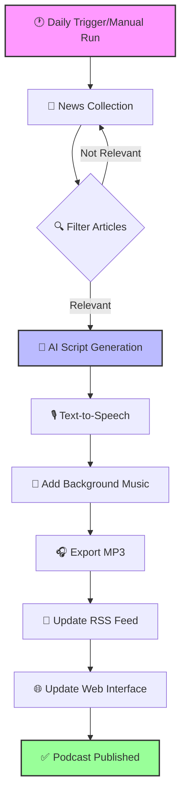

# 🛢️ Oil Field Insights Daily - AI Podcast Generator

An intelligent podcast generation system that creates daily, engaging 15-minute conversations about the oil and gas industry using advanced AI, real-time market data, and neural text-to-speech technology.

## 🎧 About

Experience AI-generated discussions between two expert hosts with natural conversation flow, breaking industry news, and live market analysis. Features real-time oil price data from Alpha Vantage, enhanced Podcastfy integration for superior dialogue generation, and ambient background music for professional production quality.

## 🔄 Process Flow



## ✨ Key Features

### 🎯 Two Powerful Generation Modes

#### **Podcastfy Enhanced Mode** (Recommended)
- **Superior Dialogue Generation**: Leverages Podcastfy's advanced conversation algorithms
- **Extended Episodes**: 15-minute podcasts with 8000+ words of content
- **Professional Production**: Integrated ambient background music
- **Seamless Integration**: Works with your existing news collector and RSS generator

#### **Original Edge TTS Mode**
- **Direct Control**: Full customization of voice parameters and timing
- **Lightweight**: Minimal dependencies, faster generation
- **Template Fallback**: Works even without AI API keys

### 💹 Real-Time Market Intelligence
- **Alpha Vantage Integration**: Live WTI and Brent crude oil prices
- **Daily Price Changes**: Percentage movements and trend analysis
- **Smart Fallback**: Omits market section if data unavailable
- **Free Tier Support**: Works with Alpha Vantage's free API (5 calls/minute)

### 🤖 AI-Powered Content Generation
- **Google Gemini 1.5 Flash**: Fast, intelligent script generation
- **NotebookLM-Style Conversations**: Natural, engaging dialogue between hosts
- **Industry Expertise**: Alex (petroleum engineer) and Sam (energy reporter) personas
- **Emotional Dynamics**: Varied reactions, laughs, and thoughtful pauses

### 📰 Smart News Aggregation
- **48-Hour News Window**: Only includes recent, relevant articles
- **20+ RSS Sources**: Rigzone, OilPrice.com, Bloomberg Energy, Reuters, and more
- **Intelligent Scoring**: 
  - Recency boost (6hrs: +10, 12hrs: +7, 24hrs: +5 points)
  - Keyword weighting for drilling, OPEC, production topics
  - Source diversity (max 2 articles per source)
- **Time Display**: Shows "3 hours ago", "Yesterday" for each story

### 🎙️ Professional Audio Production
- **Edge TTS 7.2.3**: Latest neural voices with improved quality
- **Ambient Background Music**: Subtle, auto-generated harmonic drones
- **Smart Audio Ducking**: Music volume reduces during speech
- **Multiple Voice Options**:
  - GuyNeural: Warm, authoritative male voice
  - AriaNeural: Friendly, engaging female voice
- **Optimized Output**: 192kbps MP3 with 44.1kHz sample rate

### 🚀 Automation & Distribution
- **GitHub Actions Workflows**: Daily generation at 12:00 PM UTC
- **RSS Feed Generation**: iTunes-compatible podcast feed
- **GitHub Pages Hosting**: Free hosting for your podcast
- **Episode Management**: Auto-cleanup keeps last 30 episodes
- **Error Recovery**: Robust retry logic for API failures

## 📦 Installation

### Prerequisites
- Python 3.8+ (3.11 recommended)
- FFmpeg (for audio processing) - [Download here](https://ffmpeg.org/download.html)
- API Keys (all optional but recommended):
  - **Google Gemini API** - For AI script generation ([Get free key](https://makersuite.google.com/app/apikey))
  - **Alpha Vantage API** - For real-time oil prices ([Get free key](https://www.alphavantage.co/support/#api-key))

### Quick Setup

1. **Clone the repository**:
```bash
git clone https://github.com/shariqbaig/oil-podcast-generator.git
cd oil-podcast-generator
```

2. **Install dependencies**:
```bash
# Install base requirements
pip install -r requirements.txt

# Install Podcastfy without dependencies to avoid conflicts
pip install podcastfy==0.4.1 --no-deps

# Force install edge-tts 7.2.3 (required for latest features)
pip uninstall edge-tts -y
pip install edge-tts==7.2.3

# Install remaining Podcastfy dependencies
pip install PyMuPDF>=1.24.11 cython>=3.0.11 pandoc>=2.4 pytest>=8.3.3 pytest-xdist>=3.6.1
```

3. **Configure environment**:
```bash
cp .env.example .env
```

Edit `.env` and add your API keys:
```env
# Required for AI-generated scripts (get free key at makersuite.google.com)
GEMINI_API_KEY=your-gemini-key-here

# Optional: For real-time oil prices (get free key at alphavantage.co)
ALPHA_VANTAGE_API_KEY=your-alpha-vantage-key-here

# Optional: For custom hosting
PODCAST_BASE_URL=https://yourdomain.com/podcast
```

4. **Generate your first podcast**:

**Option 1: Using Podcastfy (recommended)**
```bash
python main_podcastfy.py
```

**Option 2: Using original Edge TTS script**
```bash
python main.py
```

## 🚀 Quick Start Guide

### Generate a Podcast in 3 Steps:

1. **Set up your Gemini API key** (required):
   ```bash
   echo "GEMINI_API_KEY=your-key-here" > .env
   ```

2. **Optional: Add market data** (recommended):
   ```bash
   echo "ALPHA_VANTAGE_API_KEY=your-key-here" >> .env
   ```

3. **Run the generator**:
   ```bash
   python main_podcastfy.py  # For 15-minute podcast with music
   # OR
   python main.py           # For original version
   ```

Your podcast will be saved to `docs/episodes/` and the RSS feed will be updated automatically!

## 🔧 Configuration

### Environment Variables

| Variable | Required | Description | How to Get |
|----------|----------|-------------|------------|
| `GEMINI_API_KEY` | Yes | Google AI key for script generation | [Get free key](https://makersuite.google.com/app/apikey) |
| `ALPHA_VANTAGE_API_KEY` | No | Real-time oil price data | [Get free key](https://www.alphavantage.co/support/#api-key) |
| `PODCAST_BASE_URL` | No | Custom hosting URL for RSS feed | Your domain or GitHub Pages URL |

**Note**: Without Alpha Vantage key, market data section is automatically omitted from podcasts.

### Voice Customization
Edit `src/podcast_creator.py` to adjust:
- Voice selection (Edge TTS offers 100+ voices)
- Speaking rate and pitch
- Pause durations
- Emotional tone mappings

### News Sources
Modify `src/news_collector.py` to:
- Add/remove RSS feeds
- Adjust keyword weights
- Change relevance thresholds
- Focus on specific topics

### Script Style
Configure `src/script_generator.py` for:
- Host personalities
- Conversation length
- Topic emphasis
- Dialogue patterns

## 📁 Project Structure

```
oil-podcast-generator/
├── main.py                      # Main orchestration script (original)
├── main_podcastfy.py            # Podcastfy-enhanced version
├── requirements.txt             # Python dependencies
├── .env.example                 # Environment variable template
├── src/
│   ├── __init__.py             # Package initialization
│   ├── news_collector.py       # RSS feed aggregation and filtering
│   ├── script_generator.py     # AI dialogue generation (Gemini)
│   ├── podcast_creator.py      # Edge TTS audio synthesis
│   ├── music_generator.py      # Background music generation
│   └── rss_generator.py        # Podcast RSS feed creation
├── docs/
│   ├── episodes/               # Generated MP3 files
│   ├── feed.xml               # Podcast RSS feed
│   ├── index.html             # Web player interface
│   └── README.md              # Documentation for web hosting
├── tests/
│   └── test_tts.py            # TTS testing utilities
└── .github/
    └── workflows/
        ├── generate_podcast.yml         # Daily automation (original)
        └── generate_podcast_podcastfy.yml # Podcastfy version
```

## 🎛️ Technical Architecture

### Component Interaction

```
┌─────────────────────────────────────────────────────────────┐
│                         main.py                              │
│                    (Orchestration Layer)                     │
└──────────┬────────────────────────────────────┬─────────────┘
           │                                    │
           ▼                                    ▼
┌──────────────────────┐              ┌──────────────────────┐
│  news_collector.py   │              │  script_generator.py │
│  - Fetch RSS feeds   │              │  - Gemini AI prompts │
│  - Score relevance   │◄─────────────│  - Dialogue creation │
│  - Filter articles   │   Articles   │  - Emotion mapping   │
└──────────────────────┘              └──────────────────────┘
           │                                    │
           │                                    ▼
           │                          ┌──────────────────────┐
           │                          │ podcast_creator.py   │
           │                          │  - Edge TTS voices   │
           │                          │  - Audio processing  │
           │                          │  - Music mixing      │
           └──────────────────────────└──────────┬───────────┘
                                                │
                      ┌─────────────────────────┼───────────┐
                      ▼                         ▼           ▼
           ┌──────────────────┐     ┌──────────────┐  ┌────────────┐
           │music_generator.py│     │rss_generator │  │  Output    │
           │ - Ambient sound  │     │ - XML feed   │  │ - MP3 file │
           │ - Audio ducking  │     │ - Episodes   │  │ - RSS feed │
           └──────────────────┘     └──────────────┘  └────────────┘
```

## 🔄 Automated Daily Generation

The podcast generates automatically via GitHub Actions:
- **Schedule**: Daily at 12:00 PM UTC
- **Process**: News collection → AI script → Audio synthesis → Publishing
- **Requirements**: Add `GEMINI_API_KEY` to GitHub Secrets

### Manual Trigger
Run the workflow manually from GitHub Actions tab or via API:
```bash
gh workflow run generate_podcast.yml
```

## 🎯 Recent Major Updates

### v3.0 - Podcastfy & Market Data Integration (Latest)
- ✅ **Podcastfy Integration**: Enhanced dialogue generation with 15-minute episodes
- ✅ **Alpha Vantage API**: Real-time WTI and Brent crude oil prices
- ✅ **Smart News Filtering**: 48-hour window with recency scoring
- ✅ **Time Display**: Shows when each article was published
- ✅ **Extended Content**: 8000+ words, 12 news stories per episode
- ✅ **Edge TTS 7.2.3**: Fixed compatibility issues for better voice quality
- ✅ **Background Music**: Professional ambient soundtrack with smart ducking
- ✅ **GitHub Actions**: Dual workflows for both generation modes

### v2.3 - Production Improvements
- ✅ Configurable RSS feed URLs via environment variables
- ✅ Automatic GitHub Pages URL detection
- ✅ Improved error handling and retry logic
- ✅ Enhanced documentation with flow diagrams

### v2.0 - AI & Voice Upgrade
- ✅ Google Gemini 1.5 Flash integration
- ✅ Microsoft Edge TTS neural voices
- ✅ NotebookLM-style conversations
- ✅ Smart URL pronunciation
- ✅ Industry term handling

## 📊 Technical Specifications

| Component | Specification | Details |
|-----------|--------------|---------|
| **Audio Format** | MP3, 192kbps, 44.1kHz | Optimized to 128kbps in GitHub Actions |
| **Episode Length** | 15 minutes | ~8000 words of content |
| **Voice Technology** | Edge TTS 7.2.3 | Neural voices with emotion support |
| **AI Model** | Google Gemini 1.5 Flash | Fast, efficient dialogue generation |
| **Market Data** | Alpha Vantage API | Real-time WTI & Brent prices |
| **News Window** | 48 hours | Prioritizes articles < 6 hours old |
| **Update Frequency** | Daily at 12:00 PM UTC | Configurable via GitHub Actions |
| **Storage Policy** | 30 episodes | Automatic cleanup of old files |
| **Background Music** | Ambient harmonic drones | -30dB volume with smart ducking |

## 🐛 Troubleshooting

### Common Issues & Solutions

| Issue | Cause | Solution |
|-------|-------|----------|
| **No audio generated** | Network/TTS issues | • Check internet connection<br>• Verify Edge TTS: `pip install edge-tts==7.2.3`<br>• Ensure FFmpeg is installed |
| **Podcastfy dependency conflicts** | Version mismatch | • Follow exact installation order in setup<br>• Use `pip install podcastfy==0.4.1 --no-deps`<br>• Force reinstall: `pip install --force-reinstall edge-tts==7.2.3` |
| **No market data** | Missing API key | • Get free Alpha Vantage key<br>• Add to `.env` file<br>• Market section auto-omits if unavailable |
| **Old news in podcast** | Date filtering | • Check RSS feed availability<br>• Verify system date/time<br>• Only last 48 hours included |
| **Short podcast (<5 min)** | Using wrong script | • Use `main_podcastfy.py` for 15-min episodes<br>• Check word_count setting (should be 8000) |
| **Script generation fails** | API key issue | • Verify GEMINI_API_KEY in `.env`<br>• Check API quota limits<br>• Falls back to template if unavailable |
| **Background music missing** | Audio processing | • Install numpy: `pip install "numpy<2,>=1.24.3"`<br>• Check pydub: `pip install pydub`<br>• Verify FFmpeg installation |
| **GitHub Actions failing** | Dependencies | • Check workflow logs<br>• Ensure secrets are set<br>• Use provided workflow files |

## 🤝 Contributing

Contributions welcome! Areas for improvement:
- Additional news sources
- Voice variety options
- Language support
- Interactive features
- Better music generation
- Analytics integration

## 📜 License

MIT License - See [LICENSE](LICENSE) file

---

*Powered by Google Gemini AI and Microsoft Edge TTS Neural Voices*